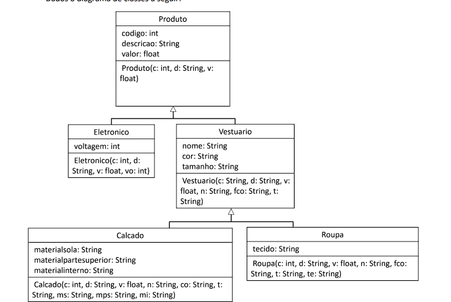

# 🛠️ Exercise-POO

- Códigos em PYTHON
- Comitar em git
- Atualizando...

## 📸 Image

|---------------------------------|---------------------------------|

|  |

## 🚀 Functions

- *Linguagem* - Python
- *Bibliotecas* - Tkinter
- *Versão* - 3.9.7
- *Sistema Operacional* - Windows 10

## 📌 Notes

- Aceito sujestões de melhoras
- Em constância evolução
- Atualizando...
- Funcionando

## 🛠️ Funcionalidades

- ✅ Manipulação Python
- ✅ Totalmente remoto
- ✅ Comitando pelo |GITBASH|
- 🔧 Melhorias futuras

> _“Tudo tem um porquê, nada é por acaso.”_

|---------------------------------|---------------------------------|

|  |